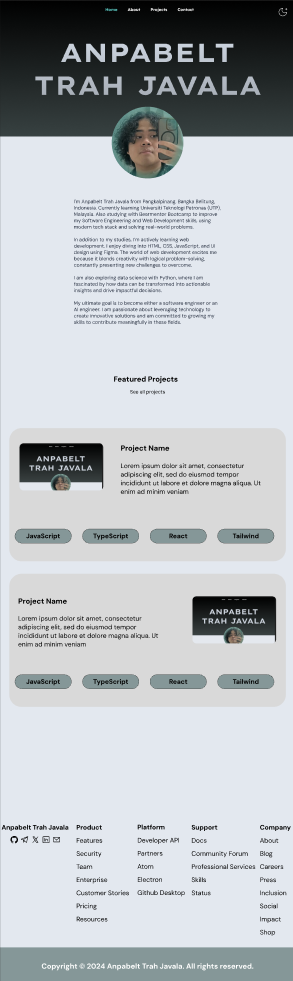
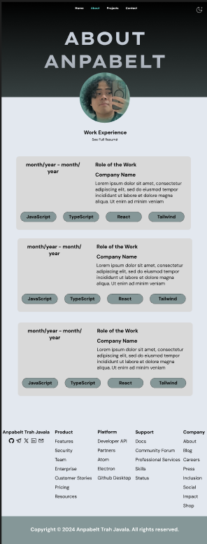
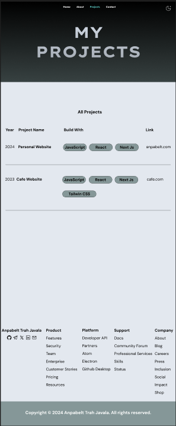
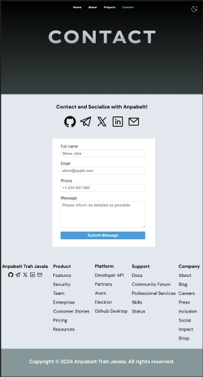

# 🧑🏽‍💻 Anpabelt Personal Website

Welcome to my personal website! Access it at [anpabelt.com](https://anpabelt.com)

UI design on Figma: <https://www.figma.com/design/f1F1KJzzDHD9ve07mnpxvT/anpabelt.com?node-id=0-1&t=SZZItoGxZHuU4vqS-1>

This site is designed to showcase my **projects**, **experience**, and provide ways to **connect** with me. Below are the details of the sections on the website. This website consists of several features, such that:

1.  Home
2.  About
3.  Projects
4.  Contact
5.  Footer

## 🧑🏽‍💼 Home

On the Home page, I introduce myself and my passion for creating user-friendly and visually appealing designs. This section gives you a glimpse into who I am and what I love to do. You’ll also find a preview of my featured projects, where I showcase some of my best work.

Design:

Highlights:

- A warm introduction to who I am and what I do.
- Featured projects that reflect my skills and creativity.
- A gateway to explore more about me and my work.

## ℹ️ About

On the About page, I share my professional journey, from the roles I’ve held to the skills I’ve developed over the years. I focus on how I’ve applied my knowledge to real-world challenges and how those experiences have shaped me. This is where you’ll learn more about what I bring to the table.

Design:

Key points:

- A clear timeline of my work experience.
- Descriptions of my roles and responsibilities.
- Insights into how I’ve grown and adapted in my career.

## 💻 Projects

The Projects section is where I highlight the work I’m most proud of. Each project represents a unique challenge I’ve tackled, showcasing my technical skills and creativity. I also include the tools and technologies I used, giving you a sense of how I approach and execute my ideas.

Design:

What you’ll find:

- A list of projects I’ve worked on, organized by year.
- The technologies I used to bring each project to life.
- A reflection of my versatility and ability to deliver quality results.

## 📱 Contact

I want to make it easy for you to connect with me, which is why I’ve designed the Contact section to be simple and straightforward. Whether you prefer sending a message through the form or reaching out via social media, I’m always open to conversations and collaborations.

Design:

Ways to connect:

- A user-friendly contact form for direct communication.
- Links to my social media profiles for additional ways to engage.
- A welcoming invitation to share ideas, feedback, or opportunities.

## 🗂️ Footer

The Footer ties everything together with useful links and resources. I’ve included quick navigation options to ensure you can easily find what you’re looking for. It’s also where I showcase my brand identity and provide essential information about my work.

Features:

- Links to product features, platforms, and support.
- Copyright information to reinforce my personal brand.
- Additional resources like careers, press, and shop for added value.
